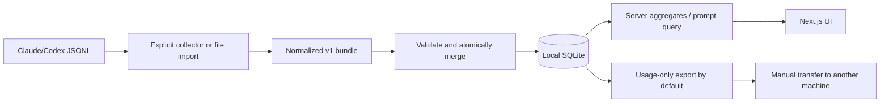

# Technical design

## Runtime

Node **24.x** with built-in `node:sqlite`; Next.js **16.3.5**, React **19.2.8**,
App Router, TypeScript strict, Tailwind 4. Zod validates boundaries, Vitest tests
semantics, Playwright tests product flows. No native database addon or API key.

Server-render initial aggregates and shell. Client components own forms/filters.
Keep filesystem, SQL, parsing and pricing server-side. Fetch prompt text only for
the prompt view; never serialize the whole database into a client component.

## ADR 001 — local SQLite

Persistence, atomic import and CLI compatibility justify SQLite. Database defaults
to `data/token-atlas.sqlite`, configurable with `TOKEN_ATLAS_DB`. Use parameterized
SQL, primary keys, WAL, busy timeout and transactions. Node 24 is required.
Synchronous SQL is acceptable for bounded local files; hosted concurrency needs a
new spec. Cap bundles at 20,000 usage events and 20,000 prompts, HTTP bodies at
20 MiB. `npm run dev` and `npm start` bind **127.0.0.1**. APIs reject non-loopback
Host and cross-origin mutations and return no-store. This is not hosted auth.

## ADR 002 — provider normalization before accounting

Never sum repeated Claude blocks or Codex cumulative snapshots. Usage identities
derive from provider/session/message or response identity, not a filesystem path.
Legacy Codex uses cumulative differences; resets are diagnostic. Modern records
take precedence over legacy records within a file. Unknown model IDs stay unknown.
Source formats are implementation details, not guaranteed public APIs. Regression
fixtures and diagnostics define supported shapes; see `docs/providers.md`.

## ADR 003 — auditable price snapshot

Checked-in exact model IDs, USD/million rates, source URL and verification date.
No fuzzy aliases or live fetching. Estimates use one rate snapshot, not historical
invoices. Plan charges, discounts and unobserved priority/long-context multipliers
are excluded and disclosed. Unknown prices show coverage and unpriced counts.
Standard GPT-5.6+ cache writes use the documented 30-minute tier; absent write
rates are represented as unavailable, not zero.

## ADR 004 — explicit collection and sharing

CLI receives explicit roots, member and stable machine ID. Skip symlinks, bound
file sizes, report diagnostics without echoing raw lines. Browser raw imports ask
for provider/member/machine; portable bundles carry those identities. Strict schema
rejects absolute source paths, outputs and opaque metadata fields. Human prompts
render as text. Default exports omit prompts; inclusion is an explicit choice.

## ADR 005 — isolated demo

Synthetic demo data appears only on explicit demo view, never silently inserted
into SQLite. Local usage has an honest empty state linking to import and demo.

## Quality gates

`npm run check`: lint, typecheck, semantic tests and strict OpenSpec validation.
`npm run build`: production compile. Browser tests use a temporary test database
and synthetic fixtures. Check persistence, duplicates, failed import atomicity,
prompt exclusion, unknown prices, filtering, keyboard access and mobile overflow.
